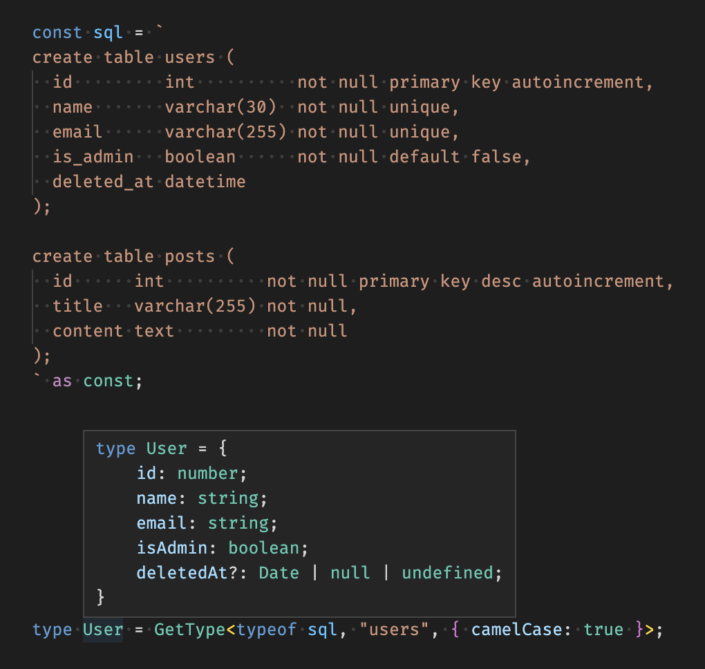
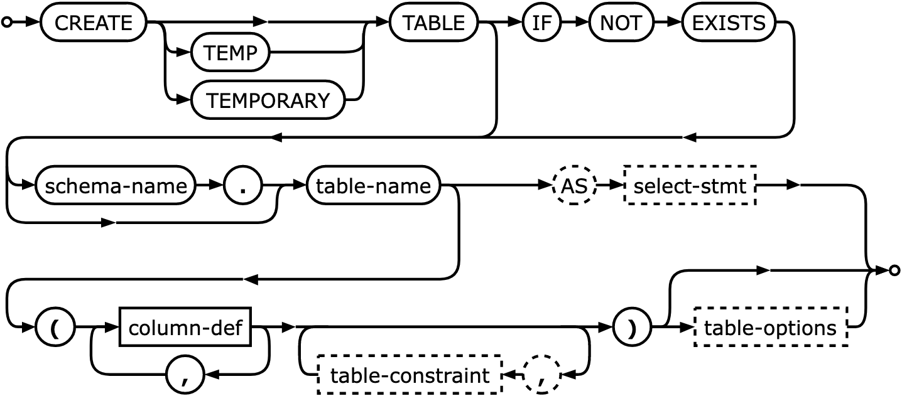
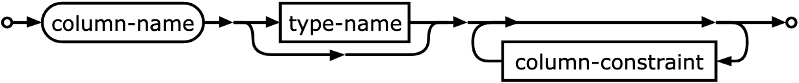
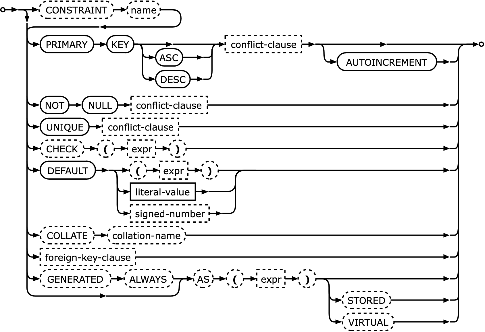
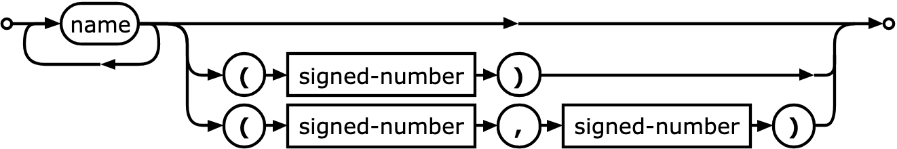

# TypeSQL

## What?!

TypeSQL extracts type definitions from inline SQL `CREATE TABLE` statements. SQLite was used as a baseline dialect. Things may work for other dialects too, maybe?



<details>
<summary>Implementation details</summary>

---

Screenshots below are taken from SQLite’s [`CREATE TABLE` documentation][1]. Dashed shapes are not implemented.

[1]: https://www.sqlite.org/lang_createtable.html

#### create-table-stmt



<small><i>Note: unlike SQLite, TypeSQL accepts trailing commas after column definitions.</i></small>

#### column-def



#### column-constraint



#### type-name



<small><i>Note: unlike SQLite, TypeSQL has no limit for the number of type parameters.</i></small>

</details>

## Why?!

[Oh! It has future applications in propulsion, energy creation, data transmission, you name it!](https://www.smbc-comics.com/comic/2010-12-09)

## Usage

```ts
import { GetType } from "@izeau/typesql";

type ExampleType = GetType<SQL, Table, Options>;
// type ExampleType = {
//   id: number,
//   isOk?: boolean | null | undefined
// }

// SQL must be a const string containing at least one CREATE TABLE statement:
const sql = `create table example (id int not null, is_ok boolean);` as const;

// Table can be either a ["schema-name", "table-name"] tuple, or a "table-name":
type Table = "example";

// Options is an optional parameter with the following properties:
//   - camelCase (boolean, defaults to false): wether to export column names as camelCased properties
type Options = { camelCase: true };
```

## Live demo

You can try it out on the [TypeScript Playground][2].

[2]: https://www.typescriptlang.org/play?#code/PTAEAsBdIBwZwFwgOYEtLgK4CMB0BjAewFthUAvAUwENNhIBPGSuARwBsAoTogOzkig27UAF5QAAx4AnGpEqhI1bOwWY4laXFAAKTqFCoAJgdNnUvQWeu9Cg3pnYiY01MWrSGoANaUvtSEILfFliSksAGn1QXmow6wMANw98cA8dAGYABgBKA1t7RxFMXlRWTEoog0p3VBFrZOlU9IAmAFY2vIKYotASsoqqwzgAfWojYgtTbEJCVWpeBO6HJ1AjSgAzWnZBLfYNIfXVeSMxwSNqeUg3Sk4cgG5uELkFJRUFGEIBbT0DYwSLFYEvk7D1Vi43B4vL4vOs4PhQAEgrxnmFItFrpBVKZGs1pDp2p0YqCVuwhnx5JZFJQAB5ApYkop3R4SRHaPgCR6cRjMUAAVQ00jEoAA4pRIAAVJiUAA8PMohA2Qg4EVAACJ1Jo4GrVQBvUD4OKUdgAYWoGgQimkFVAAF8AHyPECmAB6AH5uPLQAAFL6CcRiyXSuXSxXKsnqz7fHWgfWGsKm82US2Qa0KB1OsAGd3cXN57jAABUYlEpbL5Yrlar1dLoEL+mLAFEAHIAEVAAHkAGKgRsADQAggBZb0AGUbqoAyhKBwAlCWdnsASRH46HLZnEqXHebdYbJZrh6PVbrwG4tM+0kEXu9rncngA0n4TYR+KnqICZc2jaBaZSjNoAiuLwyCgAAPmC7D2sK+oACTypaADkt6Qo+z6vkBH6WIhqqxGElrfvEtqPBehBXoo0qgM2djNkUL5vtIWGQF+P5-uEAFCKmFigRBpLQaY4hwQhoCIdRkC0U49GYYCOFmHhyZUT+xGcKR5FenypTlJQUnvp+hEKGxvAcUB3HgZB-ECbGoDwdKSEaQM2kYbp2GqnJRoEUpJE0pe16Ua2mzbJAOmMXprF0uxgFcSBZl8WYgnWcJiH+VsjhBU5IUuW5+GKURXKqb5vISsoqhLuslioBsqCaDK0STqkNTUL+4VGZFwE8ZBQxFe8TX-q13FRNBgnRDZzBIV1JVldclWaDh0TwuADWWnVC3uEMbyqJa42VJwykqd5ZEFQoraXNQUrMDVBhnQZzXGVFyBDAO0jINohm3W1ADaAC6wpfQNMHDYlx1KFds0GMJV1DB4z2Wo9z1RLt+UUbyL7sJgxC8MFTEsfEr19dFvFFIN0QQSh94ME+DCY6FYT2sTVE0XR6VY-ptMGBB9laVTljY5QrNmclgVc8xLN5ftamUSjaO8MlFjoKgr4XTl129ZxbWdZRuOgEDp3BgsDCqnr0EE6s4ikkMQsvTd2iS+jQsyobX0-Z9f1DQYI0KYhNvS5ssvXK+oMxO5StrbZoAQ9EHLOZAiCgBb8Oiz5SMKF7MulH7-CK17lsqynPtp-LvD27w+uIsXBvF-aX2cINsYA6HntzFLqdyxhAdEKj6Mx1n8fnmLh2x7IlyUFtk5KPIaLMdEEo1JeUI9RFoAzHMNC8EMy0NfPLWq6ZxtklPxXKwvJkgebjed5vHG55V+cK3r5clw7zvV-9buJSag-yCPY81OEkAB+Ps9PCbRnmRKEQx5qLVAOvVaGID6bQPuSM+-BLTdx2gnA6SdQAACEkzUXWGIOmW1Sq-wqlVaQRcH4VzptrK6FD758wgl7O2hs6ZX19gXOhpdKEMAYbHJBzd05wAobw9+Lwv5Dwnpwu+XD6FeUTl6WixBsBamFIhLIiEzKIQAIwaIgohFouiRIZEMYhAALCYtoJiABsJiADsJiAAcJiACciF0Hi15JOBgSi5jaFEHTRC1ATHYBMfgExRgTGUBMRsExyATHgBMagExAArEx3gTHsBMcQRCATeAmMICYmAJjWAmOkCYuAJi-6aMwCYxIJiADuJiaQmIYCY8gOS2YiQHCYrBJiTQmNbCYxsJiuwmJFCYgAEiYpcJiABSJiHwmNHCYocHTNHNhMR2Ex3oTEAEUTGzhMZOExEoTF8hMQANRMQAdRMX2ExABNExAAtNZej1GaJ0ZogxmjjGaPMZoyxmibGaPsZopxmjXGaI+XokYJjYJuN7vIiWTNAR+ICeaN5Il1gpR2FixCBR8UQjJvi-oWlEV7WRbyCm9SyIcX8Z0wJFSMXwnxUiYIoRf74ueEPfFcIwkBNpKgb4+K9gaHxRVfFMJ8WknxetKJASAFypAYxTwcq0z4sSKgK8mBqCZNYaiywcB3H90DFdDsMBBEvwNEaRMGg3SWiXvMXgjwEZ90wWa4M0Qly8BgJgQQmtj73X3t1QNd0zLvSDTFIoqog1PwMBaq1mtPXMETQXPxVl4zGjNBaUAYr0wuzDgfC+eNkDRDdKKcUtCfV+sgKqd6Zsi3vGdp2S16a+aWm9B4DQMoJSEF8KUKgMoa3+vtNBTWFgNiaFALOFgqVy0zrnTsEtPpu3cUbNIaQZFhHRAMBW2dcB51mEtAe1KK6cEaDwZQKuZgK1bRXZG8Nu9Y13U+ru0wFaU2UAmcaZg0gtEylPTsVUW1VRpownzY9MRKCJE0O+y0vAYNwYMAhpD0hPSUS-T+9gf6AO1W-hPbOC8L2UCvb9EN2JNaPratGpwL62rxtbUmq2lagyprbRhQto8JG-yI1vG9oAK1dq0Ouzd26JBEEcCYbo18TDypErBXUW13pZG+prUkgmRIaMtBIRTynVO2lwBIW0emD7vS0Z9W0iEJAdqgQR3jKm1MsdEUPcR49f6cP0y25TFnVSTunVnPmFbGzeQWEYGUup30GHeiaQwiws4NrRso6Q31zSsauthv9LQZQmjAxx-gqp832k+igldbCb6F2kf5oUEMuHQQrUOagMAaHBiutBVDsH0NmFtKAAAZLXBIMW4t8I7vwRLSjNCpe0Fh39mhsu5aY+m1UqYKjFYdbHMr-C84t0q2XOLU6avSnoZpxrzWTq0La7RkQHXkOmAdNES0M2cOaAA0VOoMpuPuaNfaEDCDFsQa5F6J7WXM5IM26NgRHDpHQ4rkMcD-AV1fvh3AIYEl2DFs1k6lehavbg6btt9OMpqvBxkftgLhro5BdAEuOAaOD45Yp3AcdLG6fvHfRW5HK64y2pzQpFb6ZNNmgTLznm7Wlbweg51h7kvNCA8ojT1nqhQcMSYnxy+SDmEV3IwYUehAYArocBN6QjtxDkZrhbB9b691WgqNL3XMB3pqlUCBDAaonMqzaFkBd-PpcW0cyusSaPNc8IXfm6XCuij07e+wBnKu0U-Z9OocAH3AgwFVFkMdcvkY86TIrEdAaWNBqGEBgvKso3iEQgHPkMA-3Nj-CurHCxhT5sLfnldleF0l-D76-1K7dO6mJyaNI0gTMD94AdxdAhbRSGt0Pjw7e4Xs9jjnntB662T9SsttMkHQAoJX7KNfqp+8l9H9X2v9fNb8802fzQhoe1z+kGLh-0-Ct6o0LZxDnWs8KFOy186U8NYWM-9ZQYceErtC0roV1gCidx9p1asWFohnQoBYBEAQB6l0DcBhB0BKBcAyJkBgALgx5pQMhcAoBiB2AABidYeQaQSYWIdOEYRUEYduKWMYDYa+dABgBdSAzWfvINUfRCJcZsU5YEUQ7rRTfg1kYECtQ3ZLaXHgljPgu6AQk0CZOcPpUcDsXpTRCUfsU5UfSQ0QitINeQwAlWJQtqAQrBTQ7QsQ0Qgw5Q1kXea-QEBxR6RiLglDMOMwheCw7iAQ2cRsAcZZTRLsTQ7pTRVsDsPkXpBwywqQhIGQpLODRAsAGYBwOAUw3kXgiQ5QxTRCLBDsDsEIuw4EOI-whI6wCtRvXgLIw+LePwkCAQrcdcAZAcXQjRew3I+IowrWIebgAwZ0PYdgbAagfAbwaXWQ27G7aQLkZ0HleQUAXAZYzgeYj+V4FVOeCCABJYlYm8btbSdYtzH+bmKeftcIUcYVUvBePtAdM3YUW4i4q4-3TWGlOlR4wuRCBYqJKnD4y4gQczd3BeN46QIwD4mURCABUBNVTRJVHfITA4lzT+A+T7E4yATLF7D7cACqZiP4q41UFoBPfnHfTtREo4lE+zSwDE-9XtD8GPPEgQBPIraXYTDQDdLdchVk0TDk3tc43gf4yARzR3ZIVGSgN3TPAsMAZY3ARQYtaU1YqU5Y2U7qCqYkAvK47QeU-YrQQ4sRCknjKk2bGks4gdAUldD47XMOTYzwBvWYZ1CAvkgUl4ljEEsEvkiE+VRCKnd6BkwU3zMOR054lobzQMgEjIT6IE-jV08ExCSVBPaM90glOwL01UBMgdCEoVEVYrJfVk3U1zfUr7dEo07LScbEjYXE0M9fUxBPaeYgQBEPKDXMpE4eAstE6k7LaPXk00q4ms60hs3fSCOYxUmUmUCBdwe0XAOUA+aCeU50aU0AKc94GcvYyiJs8k94VEiedsxWX080vky02s+s205eBYQtH0ysxzEDC8-03096YMyMjid6LxHxdgcE4naBagBPMURDVwfAGM3AFMqBbxGYV8904nLabM63NcvUjcykos57aQDILEnErsp4gQVUDIXsus6EkuD837Jc+Qi81TFdZ8kCt82AmrachdaC-M2Cg0+Cv9JCzs30rC+s3CGNJtVQWzXM9k7dLkkCXi8hRCC8SgfAE4ZU7EeSL0x0SU3YmUnQOS7kVcskmC1QTc3+akpCk0tC64reC0xjQ8nC48+02qeqdwFdKNZ9Cjeot6fqZ+cQW84i5NcITQVAP8xMnQL06ixErbDgwRWk97Fi5nFWXM9w6gBgEvGAifbuMnGrSsvzCi3sMTR-JfQSldfi5AQSndRI1dHUrKwSnfLwrOPHdGSHW+PbUAyuK3aQ3KjQSK5s44yRQy1VXCsy6gfC1QVUQLK87sxkqLUwGYiXT-aY2qygLKjKrKtUESsSygEwRCTytUMdDDXkJs3y9hDCHcysvcu4xjEvEq72PyqHCq46nhE3UAS0uvWal8YgcyzHO0leZvN-baGuRyh86bFy38mMnILyqCg4sKiKpdZiEvX7QKysparw3cqjaqhEvK5KmUCauGqa7yUS8SxCb6xa2zS6owa626ljH3a3V6xHD6tymMiIH6j9Ua8rHbIRZisG1UEvEk0a8atdASxG6a1GsmjGlknyiHAnDhX0+mwGmSpSlanm-HQ6hWbS-kq47a8IS0vazWKmwnUA+he4hyoit6oCl88iifFmbg68zW781y9y9MnCExb6+EymtairGmuk1C6Wxk1Ub0JPQDQGrq62nbUXIk7fCXW8izFdNM8IWPaSb7HMsW0qvm18akgK+kumjfYDJWRm3M6A2m3qyAMddKg4yK8Co7WKgMtOhKifAq-q4LZKzOkTVmnklhXoniuG4u0QzaHwreaAyq-q36nUpWguaOgW+O9ffSEDaUQqgamXLrawUk2GnkhGnkpG5gGakwQgxqeULmrw2uyelmzKuGiQdm2ag0MHeSXQZAOwJCPTDW4UvVCoN3KzHIGzYW7UjQTuqOo0zatO2W3geWwG-asq3bbhVWxjfSCyu6dWbIoA87XWCuK7YUM2eyq2uPI1e2gU4KheUKzdcK7OxKphRnQuuA+KvO+uzTNKzWKe7dauim1e7dPBoqjXRnfa4PKqsOjuj2-ynu52uAZPYGkbcW9awufu7w5gd20bC2MdLfVbIatDbmievi9eya7ekwSODKSADG7-Ua6AqWs0zWfS4vD+sNGjCvWaF6jWomn8kmxMsmzRC2syQOwuQR7ynUyK6AhmnqnS2zQmzWUiuYHWuAwemxjQFOu2li1UG-JoXPBWljSvTTSAnTRTE-ayJTaUafcGgclxljI2z6jy8m-dLR0JtZdutkuGoh8hNUKGNGXjUAYgdQQQZRUAFwUS2ane7AfwJOZe4e5O0B5gWGW20GtOhPBm8R3Jteiuje6emR3e2B9fOAYCuYUAMiX8IyKZpUFg9GNYSO3gLmkWhQFp4GaUdp5+nS1+y0kjBQsvQB6IdpgBj6b6U3P+ygK6kgXGlWGox6-YZ6h4gx5yoxk2oOtG9Jqia57G25xqTWMPW9JmvJqRtm5GuexEJ6YpywJplerOwGmUaAg53O9pmsvxsG5x155J4mj5z4smqnLGnGgFvGtMehnx1pygbZ1Opx1UFFvh0ANFiXMhzksFoZiF8SopieJpy0c8tOy8-OnSwEzW96FJ4x9M981AZARYTWRCAAahMQAFpALFFksPGhQLlz7eZoblHKXtnSyUKe7CS6WkxasWHk92mj9FNJwpWZXQmFXNMwmlpbXR9NXRT4nhHeZCL+WnKWdkjpB1XQA3WRGcnKBgDqWMWumTWNAzWXbLWg2tXvaQ2Bzhr0M1mYGQ7o4dmHbdKOINHogQmc4qHRnhEzqLqwojmaNnDTYY1oGkmVYxW8WITTG9ELbvGqWUGAbD0dhXbu318WLvWhXfWVZLGISyUKhvnVrRmOnY6o3E9WHe3N9+RNIKg7YWYEneXXrHGc3hWH1R3EJiUoRAL93pVILNNczSYoQKY7YDXyz4H8TQBjXe7VQ9avC+Wh2Qz+WLMRX93CV4y-BaVQSYzZUz2Yb77GdkK72jWE9zXF2E7A9GYS313bN32d3VNt2nTv292AP3jEycVAoVX-XwTDYzJR42piPwGIJ93+doknqvSdWp3M2hFb2KyC7H2YOXb2GBZUo12jQx0P80MlGL27wr30IS3VGZb1H9zdrMmi2BGKdS2-6K2j4n0OpoHUOnT0PBWd2sOqN93zQwlNF+Vj2cOgPEz2UUROVsJQOM2o5mOyzWOdKCSOOF32HL20JKYFPkPB20PNb9PWUjOWBDO9ELPUQuUqdGO7OY773Hb522G3afQROPPeOaYN3bP5GaacHYO3OkvyYxPM2vbb7lLbHEXogr1z1cFCB1hOotqpOdqhgCGWN8nhEIGa26NoHItX565cyS8A5bB1gCIqvtowZKzNp4rohNAOTLRBKe503kGPDIqyuhu1GWMSMyMDLauWN82DBGuQq2XiHKPIJIHa2a5OuEpuuEW+3EUQQBv6Z1gBTHgRu06xu07HvfxkrpvkrXUTVMFczs2VuVZtve6KvL0huy2n59GX6obO9AafPNPDbcWYz7hJ2Djov-He7uKDj1LuYWLy66rEXicr0sG4q2Pic8HS6OS8fuSDv+zrdBLmXUfmHOOEur00vU2hOse4L-vJOtvpPC0aLkS6LCyYv068fKA0HdahviftOBTpfyekrKfCH9vyESHQ38rkqk7LvUovwpeZeezemxrQWBmsrEIShvBbB6lFgBB6LpKfu77qfyEhwWA4BqBkAbLS1TvSnnfXeFIne4AXe3e7RHg77DeeTdukHlfhEa4evEWVaFeyIivCo+SKBKB8888e9c3S0hgf1xgzm7LLo6S8+T5oGc+TBZXPKzGTEW2RIALNFkfwJ5WlW1kK1RXEf3TS-0W6hqrLRS+A9-XMiCbk+qBVXqp89VRK9VQO-pde-ZW1Rm-tOU+yPuIY7x+5-bMZ+WM5+1R9aB1F+7oV-1REJFrp+aAy+WM3H9gd-whF+JmY8x+tNJ-T+BOv9lqFAPiU+R-yFvUM+i-g0DBC2VOasaIBv0ramRxA3oa5t4GHQZ8fsJfU-n3yNwD9wmQ-UjP62DrFNoBtaBPMfkBqj5S+8TaXO9E-7gkHG1ODPp9CUbv8qAS-ECOn1rS-8hguyTAHYGHhN0OIR-QxFv1bw-8ciY+CfFgk2BkRKAo+JgSwKuij5icA4cspoGnwLonyd0cEgII2BCCE8Ugmgt3xHqv8F+1A2-nQN7zaN8+wPAwcXwMAgDABYAn0JAMwGjpC0ZgreBfyQF3oUBF-dAWEGsHp0rWuoE-IpnwE2ZCB-VUcIQHqS35gmQtFdMTkCHBCgm+PPtm3U0yRCQhMQs9K8VM4AQ4h1uUdgkOiHi8ha6QgchfxIG5CG6I9IYGYHzzvoKBWgqgd+ifpS0U+wNAtrJwXh6w1a2gnIX2xXQtCdW1QxWGYGqEl5ASpQ0wNlwS79DAajmHfFi135UAu8lKDBF6B6Hf96Bxgv-kYN57pkg0VVJ2Nn3gErDhQEAygFAPzywCC+dQX-sKCkgYDjh3A5YVkxh6xCvCdg9gSJCv6DpZQ0eQWn21sxt5eCirRVjEz1i2gAAOrwEUzE418sgwftMIPwsB18PTR4bsNCYgj5+PQj4Rjx84p80+9-UviDSgjhDEqYwh4cgOhHd0UB7DeESm0E5zCPECgRtuCWDbu9t4IEfiPFHdhIRG2skUACKQqCWgGRQfakf3FHZ8iVhLIqyGyJEiulOR3IhSHyOUiIwFERHd0sKMLx3QLIrIxKJ-05FcitWvIrVvyPlGUQaByAekXqJFGWQhI9cI0VqOlG6jRS+o91F6AKFKjTRKotqGqLFGJQL+1onUQmztFuoqUb-Z0XaL2HiBNhBCTpHSKDHJsqOqQk0aKV4TECoxXrTpEaLjHRitaZFJMTJQNErUrBEoF6n3jBGJV8BimQEayArS98kIiKHMcnAwgYD8xDxQsbqEBFFiJ80eafOE0L5Vi5E8wyiMxU6HFwvoNcHQDoGlLYFiAMcCUHkFEDQREgQQIwHkE1g6AFo4wS0NImlKyABAlocEdONnHzjNMs4SkS-xrFxcZQA4AcQwF+jYIa470aUgODpaVCTxLHXtBeKvFYIDc-rVUOeM1hdCnYNcd8ZrAHCO5ncyAV3N9DvT5CHOaPBPFgidpxt08EpE8SFhgBhZe0nvd6A+GGwwgwwEoErGHAwnfRlIQAA

## Type mappings

SQLite’s [determination of column affinity rules][3] are used.

| Rule order | SQL type                          | TypeScript type |
| :--------: | --------------------------------- | --------------- |
|     1      | contains `INT`                    | `number`        |
|     2      | contains `CHAR`, `CLOB` or `TEXT` | `string`        |
|     3      | contains `BLOB`                   | `Uint8Array`    |
|     4      | contains `REAL`, `FLOA` or `DOUB` | `number`        |
|     5†     | contains `BOOL`                   | `boolean`       |
|     6†     | contains `DATE` or `TIME`         | `Date`          |
|     99     | otherwise                         | `number`        |

<small><i>†: behavior deviates from SQLite’s in order to accomodate standard JS types</i></small>

[3]: https://www.sqlite.org/datatype3.html#determination_of_column_affinity

## Inspiration

- [HypeScript][4], a simplified implementation of TypeScript’s type system written in TypeScript’s type annotations. TypeSQL borrows primitives and general principles from HypeScript.
- [ts-sql][5], a crazy SQL database implemented purely in TypeScript type annotations.

[4]: https://github.com/ronami/HypeScript
[5]: https://github.com/codemix/ts-sql
